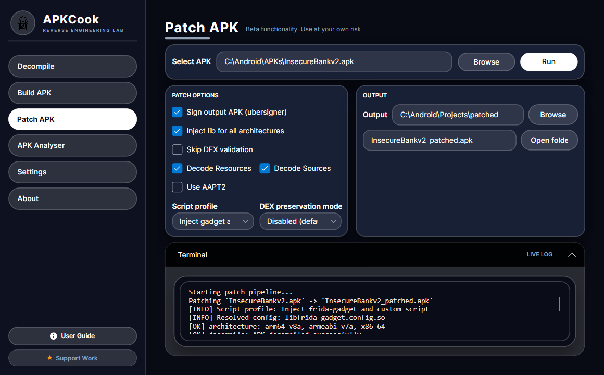

# APKCook

<p align="center">
  
</p>

<p align="center">
  <a href="https://github.com/BROHUHA/APKCook/releases/latest"></a>
  <a href="https://github.com/BROHUHA/APKCook/stargazers"></a>
  <a href="https://github.com/BROHUHA/APKCook/network/members"></a>
  <a href="https://github.com/BROHUHA/APKCook/issues"></a>
  <a href="LICENSE.md"></a>
</p>

<p align="center">
  🌍 <strong>Languages</strong><br>
  <a href="README.md">English</a> |
  <a href="README.de.md">Deutsch</a> |
  <a href="README.es.md">Español</a> |
  <a href="README.fr.md">Français</a> |
  <a href="README.he.md">עברית</a> |
  <a href="README.ko.md">한국어</a> |
  <a href="README.be.md">Беларуская</a> |
  <a href="README.fi.md">Suomi</a> |
  <a href="README.lv.md">Latviešu</a> |
  <a href="README.et.md">Eesti</a> |
  <a href="README.lt.md">Lietuvių</a> |
  <a href="README.cs.md">Čeština</a> |
  <a href="README.sk.md">Slovenčina</a> |
  <a href="README.hu.md">Magyar</a> |
  <a href="README.ar.md">العربية</a> |
  <a href="README.pt.md">Português</a> |
  <a href="README.ru.md">Русский</a> |
  <a href="README.uk.md">Українська</a> |
  <a href="README.zh.md">中文</a>
</p>

---

### 🚀 Download Latest Release (v0.0.1)

Get the standalone Windows executable (self-contained, no .NET installation needed):

👉 **[Download APKCook.exe (v0.0.1 for Windows x64)](https://github.com/BROHUHA/APKCook/releases/download/v0.0.1/APKCook.exe)**

Or view all release assets on the **[Releases Page](https://github.com/BROHUHA/APKCook/releases/latest)**.

---

**APKCook** is a professional-grade, cross-platform GUI for Android reverse engineering and security analysis, built with Avalonia UI and .NET 8. It combines the raw power of `apktool` with advanced static analysis capabilities, wrapped in a high-performance **Liquid Glass / Frosted Glassmorphism** interface featuring continuous translucent contours, subtle ambient depth, and adaptive Dark & Light themes. APKCook streamlines the entire mobile security workflow from decompilation to analysis, rebuilding, and signing.

APKCook is organized into a single-window workflow with a left sidebar for each tool: **Decompile**, **Build APK**, **Patch APK**, **Analyser**, **Settings**, **About**, and an instant in-app **User Guide**. The optional **Device Tools** tab can be enabled from **Settings** when you want ADB-assisted workflows. Each section focuses on one stage of the APK lifecycle so you can move from decoding to analysis, patching, device interaction, rebuilding, and signing without leaving the app.

## Screenshots

### 1) Decompile workflow

- Use this screen to pick an input APK and output folder, then run decompilation.
- Simple flow: select APK -> set output path -> click decompile.

### 2) Build workflow

- Use this screen to rebuild a decompiled project into a new APK.
- Simple flow: select project folder -> choose output name/path -> click build (and enable signing if needed).

### 3) Patching workflow

- Use this screen to automate APK patching actions, including Frida gadget injection.
- Simple flow: load APK/project -> choose patching options -> run patch -> verify output.

### 4) Static analysis results

- This view shows security findings from Smali/static analysis.
- Simple flow: decompile first -> open analysis tab/output -> review findings and export report.

## Key Features

- **🛡️ Static Security Analysis**: Automatically scan Smali code for vulnerabilities, including root detection, emulator checks, hardcoded credentials, and insecure SQL/HTTP usage.
- **⚙️ Dynamic Rule Engine**: Fully customizable analysis rules via `smali_analysis_rules.json`. Modify detection patterns on the fly without restarting the application. Uses caching for optimal performance.
- **💎 Liquid Glass UI/UX**: State-of-the-art frosted glass aesthetic featuring continuous pill contours, adaptive dark obsidian and soft pearl palettes, specular borders, and real-time console telemetry.
- **📖 In-App User Guide**: Instant, interactive step-by-step handbook built right into the sidebar footer for quick access across all reverse engineering tasks.
- **📦 Complete Workflow**: Decompile, Analyze, Patch, Recompile, and Sign APKs in one unified environment.
- **🧩 APK Patching**: Automate Frida gadget injection, manifest updates, dex validation, architecture selection, and optional output signing from the patching workspace.
- **📱 Optional Device Tools**: Enable ADB workflows for connected devices, including APK install, launch, app maintenance, package lookup, screenshots, screen recording, logcat presets, and custom shell/ADB commands.
- **⚡ Safe & Robust**: Includes intelligent validation and crash prevention mechanisms to protect your workspace and data.
- **🔧 Fully Configurable**: Manage tool paths (Java, Apktool, Uber APK Signer, ADB), language, theme, beta features, workspace settings, and analysis parameters with ease.

## Advanced Capabilities

### Security Analysis
APKCook includes a built-in static analyzer that scans decompiled code for common security indicators:
- **Root Detection**: Identifies checks for Magisk, SuperSU, and common root binaries.
- **Emulator Detection**: Finds checks for QEMU, Genymotion, and specific system properties.
- **Sensitive Data**: Scans for hardcoded API keys, tokens, and basic auth headers.
- **Insecure Networking**: Flags HTTP usage and potential data leakage points.

*Rules are defined in `smali_analysis_rules.json` and can be customized to your specific needs.*

### APK Management
- **Decompile**: Select an APK, choose decode options (resources, sources, manifest handling), and extract to an output folder or the APK’s own folder.
- **Build APK**: Recompile from a project folder, set output name and location, toggle AAPT2, and optionally sign the APK in one step with Uber APK Signer.
- **Patch APK**: Use the dedicated patcher tab to automate APK patching workflows, including Frida setup with one-click **Inject frida-gadget** support, architecture-aware gadget placement, manifest updates, dex validation controls, and optional output signing.
- **Analyser**: Point to a decompiled project folder, run the Smali analysis, and export the report when needed.
- **User Guide**: Click the **User Guide** button at the bottom of the sidebar to access an in-app walkthrough covering core workflows, decompiling, building, patching, and ADB device tools.
- **Settings**: Configure language, dark/light theme, Apktool, Uber APK Signer, ADB path detection, and beta feature visibility. Settings are stored in the user app-data folder instead of the application directory.
- **Device Tools**: Optional beta tab for ADB-backed device work. When enabled in **Settings**, APKCook auto-detects ADB from the configured path, `ADB_PATH`, `ANDROID_HOME`, `ANDROID_SDK_ROOT`, `~/Android/Sdk/platform-tools`, or `PATH`; then it can refresh devices, install APKs, detect package/activity metadata with `aapt`, launch apps/activities, force-stop, clear data, uninstall, open Android app settings, copy APKs from a device, capture screenshots, record the screen, run logcat/package presets, and execute custom shell or raw ADB arguments.

## Prerequisites

1.  **Java Runtime Environment (JRE)**: Required for `apktool`. Ensure `java` is in your system `PATH`.
2.  **Apktool**: You can download `apktool.jar` directly from APKCook by pressing the download button in **Settings**, or provide it manually from [ibotpeaches.github.io](https://ibotpeaches.github.io/Apktool/).
3.  **Ubersign (Uber APK Signer)**: Required for signing rebuilt APKs. You can download the latest `uber-apk-signer.jar` automatically in **Settings**, or provide it manually from [GitHub releases](https://github.com/patrickfav/uber-apk-signer/releases).
4.  **.NET 8.0 SDK/Runtime (Development only)**: Required when building or running from source. Published desktop release executables are **100% self-contained** and do not require .NET to be installed.
5.  **ADB / Android SDK platform-tools (optional)**: Required only for the beta **Device Tools** tab. APKCook can auto-detect `adb` from Settings, `ADB_PATH`, Android SDK environment variables, the default user SDK folder, or your system `PATH`.
6.  **macOS hosts**: Release artifacts target Apple Silicon (`osx-arm64`) and produce a self-contained `.app` bundle in a ZIP. Minimum macOS version: 11.0+.

## Quick Start Guide

### 1. Download Pre-built Release
Download the latest standalone executable directly from **[GitHub Releases](https://github.com/BROHUHA/APKCook/releases/latest)**.

### 2. Building from Source
```powershell
# Clone the repository
git clone https://github.com/BROHUHA/APKCook.git
cd APKCook

# Build and run
dotnet build
dotnet run --project src/APKCook.Avalonia
```

To create a self-contained single-file executable:
```powershell
dotnet publish src/APKCook.Avalonia/APKCook.Avalonia.csproj -c Release -r win-x64 --self-contained true -p:PublishSingleFile=true -p:IncludeNativeLibrariesForSelfExtract=true -o release
```

### 3. Setup
- Open **Settings**.
- Link your `apktool.jar` and `uber-apk-signer.jar` paths, or use the built-in one-click download buttons.
- Configure **ADB Path** if auto-detection doesn't automatically locate your platform tools.
- Choose language and dark/light theme preferences.

### 4. Basic Workflow
1. **Decompile**: Load an APK in the Decompile tab and extract resources & Smali.
2. **Analyze**: Open the Analyser tab to scan Smali for security vulnerabilities.
3. **Patch**: Inject Frida gadget or modify smali code as needed.
4. **Build & Sign**: Select the project directory in Build APK, toggle signing, and compile your new APK!

## 👨‍💻 Author & Maintainer

Developed and maintained by **Abin Binoy**:
- 🌐 **Portfolio**: [abinbinoy.vercel.app](https://abinbinoy.vercel.app)
- 🐙 **GitHub**: [@BROHUHA](https://github.com/BROHUHA)
- 💼 **Project Repository**: [BROHUHA/APKCook](https://github.com/BROHUHA/APKCook)

### ❤️ Support the Project

If APKCook has helped your security research or reverse engineering workflows, consider supporting its continuous development:
- Support via the **Support Work** button in the sidebar footer or visit **[abinbinoy.vercel.app](https://abinbinoy.vercel.app)**.

## Technical Architecture

APKCook utilizes a clean MVVM (Model-View-ViewModel) architecture:
- **Core**: .NET 8.0, Avalonia UI (cross-platform).
- **Analysis**: Custom Regex-based static analysis engine with hot-reloadable rules.
- **Services**: Dedicated services for Apktool interaction, patch orchestration, Android Debug Bridge integration, file system monitoring, tool downloads, and settings management.

## License & Attribution

- Copyright (c) 2026 **Abin Binoy**.
- Distributed under the [Apache License 2.0](LICENSE.md).
- Contributor licensing and ownership terms are defined by [CLA.md](CLA.md).
- Project attribution and notices are maintained in [NOTICE](NOTICE).
