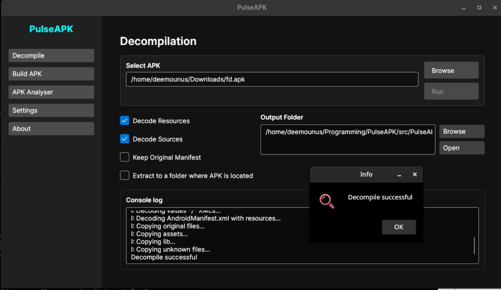
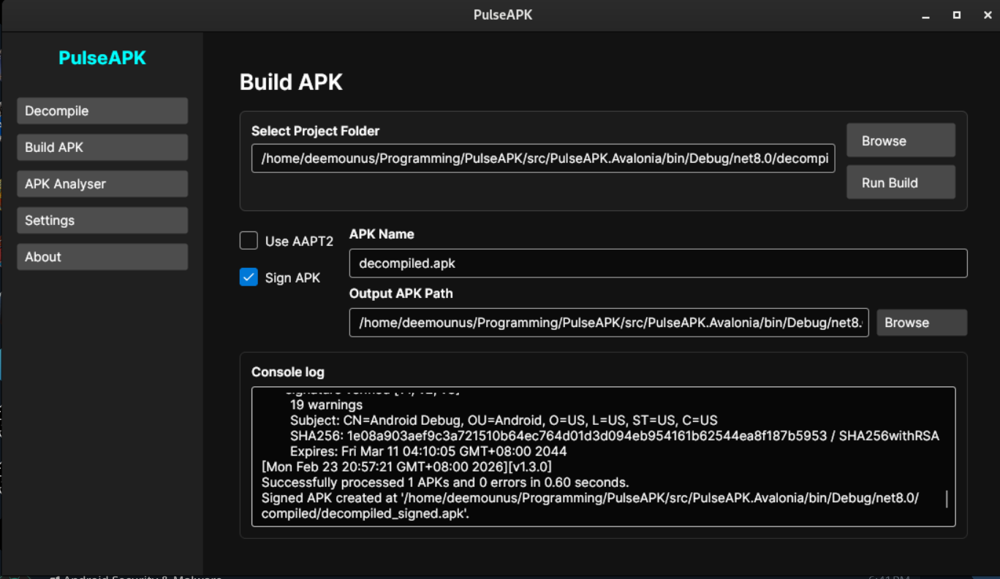
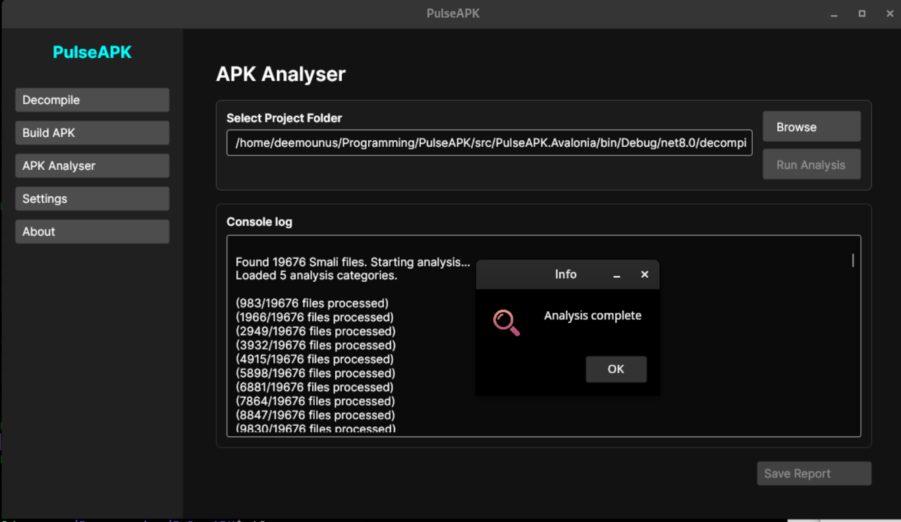

# APKCook

<p align="center">
  🌍 <strong>Languages</strong><br>
  <a href="README.md">English</a> |
  <a href="README.de.md">Deutsch</a> |
  <a href="README.es.md">Español</a> |
  <a href="README.fr.md">Français</a> |
  <a href="README.he.md">עברית</a> |
  <a href="README.ko.md">한국어</a> |
  <a href="README.be.md">Беларуская</a> |
  <a href="README.fi.md">Suomi</a> |
  <a href="README.lv.md">Latviešu</a> |
  <a href="README.et.md">Eesti</a> |
  <a href="README.lt.md">Lietuvių</a> |
  <a href="README.cs.md">Čeština</a> |
  <a href="README.sk.md">Slovenčina</a> |
  <a href="README.hu.md">Magyar</a> |
  <a href="README.ar.md">العربية</a> |
  <a href="README.pt.md">Português</a> |
  <a href="README.ru.md">Русский</a> |
  <a href="README.uk.md">Українська</a> |
  <a href="README.zh.md">中文</a>
</p>

**APKCook** je profesionální GUI pro reverzní inženýrství Androidu a bezpečnostní analýzu, postavené na Avalonia (.NET 8). Kombinuje surovou sílu `apktool` s pokročilými možnostmi statické analýzy, zabalené do vysoce výkonného rozhraní inspirovaného cyberpunkem. APKCook zjednodušuje celý workflow od dekompilace přes analýzu, přestavbu až po podpis.

[Sledovat demo na YouTube](https://youtu.be/Mkdt0c-7Wwg)

APKCook je organizován jako workflow v jednom okně s horní navigací pro každý nástroj: **Decompile**, **Build**, **Analyser**, **Settings** a **About**. Každá sekce pokrývá jednu fázi životního cyklu APK, takže můžete přecházet od dekódování k analýze a podpisu bez opuštění aplikace.

## Klíčové funkce

- **🛡️ Statická bezpečnostní analýza**: automaticky skenuje Smali kód na zranitelnosti, včetně detekce rootu, kontrol emulátoru, natvrdo zadaných přihlašovacích údajů a nezabezpečeného použití SQL/HTTP.
- **⚙️ Dynamický engine pravidel**: plně přizpůsobitelná analytická pravidla přes `smali_analysis_rules.json`. Vzory detekce lze měnit bez restartu aplikace. Kešování zajišťuje optimální výkon.
- **🚀 Moderní UI/UX**: responzivní tmavé rozhraní navržené pro efektivitu s konzolovou zpětnou vazbou v reálném čase.
- **📦 Kompletní workflow**: dekompilace, analýza, úpravy, přestavba a podpis APK v jednom prostředí.
- **⚡ Bezpečné a robustní**: zahrnuje inteligentní validaci a prevenci pádů pro ochranu pracovního prostoru a dat.
- **🔧 Plně konfigurovatelné**: správa cest nástrojů (Java, Apktool), nastavení pracovního prostoru a analytických parametrů.

## Pokročilé možnosti

### Bezpečnostní analýza
APKCook obsahuje vestavěný statický analyzátor, který skenuje dekompilovaný kód na běžné bezpečnostní indikátory:
- **Detekce rootu**: identifikuje kontroly Magisk, SuperSU a běžných root binárek.
- **Detekce emulátoru**: nachází kontroly QEMU, Genymotion a specifických systémových vlastností.
- **Citlivá data**: skenuje natvrdo zadané API klíče, tokeny a hlavičky Basic auth.
- **Nezabezpečené sítě**: označuje použití HTTP a potenciální místa úniku dat.

*Pravidla jsou definována v `smali_analysis_rules.json` a lze je přizpůsobit vašim potřebám.*

### Správa APK
- **Dekomilace**: snadno dekóduje zdroje a soubory s konfigurovatelnými volbami.
- **Přestavba**: přestaví upravené projekty do platných APK.
- **Podepisování**: integrovaná správa keystore pro podepisování přestavěných APK, aby byly připravené k instalaci.

## Požadavky

1.  **Java Runtime Environment (JRE)**: vyžadováno pro `apktool`. Ujistěte se, že `java` je v `PATH`.
2.  **Apktool**: stáhněte `apktool.jar` z [ibotpeaches.github.io](https://ibotpeaches.github.io/Apktool/).
3.  **Ubersign (Uber APK Signer)**: vyžadováno pro podepisování přestavěných APK. Stáhněte nejnovější `uber-apk-signer.jar` z [GitHub releases](https://github.com/patrickfav/uber-apk-signer/releases).
4.  **.NET 8.0 Runtime**: Vyžadováno pro spuštění APKCook na podporovaných platformách (Windows, Linux a macOS).

## Rychlý start

1.  **Stáhnout a sestavit**
    ```powershell
    dotnet build
    dotnet run
    ```

2.  **Nastavení**
    - Otevřete **Settings**.
    - Nastavte cestu k `apktool.jar`.
    - APKCook automaticky detekuje instalaci Javy podle proměnných prostředí.

3.  **Analýza APK**
    - **Dekomilujte** cílové APK v záložce Decompile.
    - Přepněte na záložku **Analysis**.
    - Vyberte složku dekompilovaného projektu.
    - Klikněte na **Analyze Smali** pro vygenerování bezpečnostní zprávy.

4.  **Úpravy a přestavba**
    - Upravte soubory v projektové složce.
    - Použijte záložku **Build** k sestavení nového APK.
    - Použijte záložku **Sign** k podepsání výstupního APK.


## Snímky obrazovky

### 1) Workflow dekompilace

- Tato obrazovka slouží k výběru vstupního APK a výstupní složky a následnému spuštění dekompilace.
- Jednoduchý postup: vybrat APK -> nastavit výstupní cestu -> kliknout na decompile.

### 2) Workflow sestavení

- Tato obrazovka slouží k přestavbě dekompilovaného projektu do nového APK.
- Jednoduchý postup: vybrat složku projektu -> nastavit název/cestu výstupu -> kliknout na build (a případně zapnout podpis).

### 3) Výsledky statické analýzy

- Tato obrazovka zobrazuje bezpečnostní nálezy ze Smali/statické analýzy.
- Jednoduchý postup: nejdřív dekompilovat -> otevřít kartu/výstup analýzy -> projít nálezy a exportovat report.


## Technická architektura

APKCook používá čistou MVVM (Model-View-ViewModel) architekturu:

- **Core**: .NET 8.0, Avalonia.
- **Analysis**: vlastní regexový statický analyzátor s pravidly pro hot reload.
- **Services**: dedikované služby pro integraci Apktool, monitoring souborového systému a správu nastavení.

## Licence

Tento projekt je open-source a dostupný pod licencí [Apache License 2.0](LICENSE.md).

### ❤️ Podpořte projekt

Pokud je pro vás APKCook užitečný, můžete podpořit jeho vývoj kliknutím na tlačítko "Support" nahoře.

Hvězdička repozitáře také velmi pomáhá.

### Přispívání

Uvítáme příspěvky! Upozorňujeme, že všichni přispěvatelé musí podepsat [Contributor License Agreement (CLA)](CLA.md), aby jejich práce mohla být legálně distribuována.
Odesláním pull requestu souhlasíte s podmínkami CLA.
